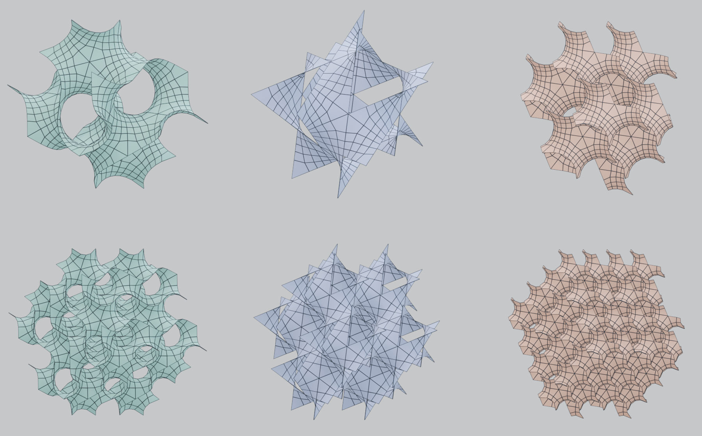

# PureQuad TPMS

[Chinese README](README.zh-CN.md)

Topology-native TPMS meshes for Blender: analytically generated,
lightweight, and ready to edit.

PureQuad TPMS generates Gyroid, Schwarz P, and Schwarz D surfaces directly
from their exact Enneper–Weierstrass parametrizations. Instead of extracting
an isosurface from a voxel grid and cleaning it afterward, the add-on builds
the surface as a deliberately structured all-quad mesh from the beginning.

## Why PureQuad

### Clean, simple topology

Every face is a quad, and the edge flow follows the surface's own parameter
lines. Exact fundamental triangles are paired into genuine four-sided macro
patches: 48 for Gyroid, 24 for Schwarz P, and 96 for Schwarz D. Their shared
circular edges lie inside the patches rather than appearing as topology.

The result is a compact, predictable mesh without voxel noise, arbitrary
triangulation, or a retopology pass. It is suitable for loop selection,
Subdivision Surface, Solidify, deformation, and other ordinary Blender mesh
operations.

### Exact surface evaluation

Every vertex is evaluated from the exact Enneper–Weierstrass representation
of the minimal surface. Lowering the mesh density simplifies the topology
without replacing the surface with a coarse voxel approximation.

### Fast generation

PureQuad TPMS samples two-dimensional analytic patches instead of building
and extracting a three-dimensional volume. Generation feels immediate at
normal working resolutions. The add-on is pure Python plus the NumPy bundled
with Blender and has no external dependencies.

### Seamless periodic tiling

The generator creates one cubic unit cell with Array modifiers for X, Y, and
Z. Periodic boundary vertices correspond exactly, so adjacent cells join
without visible seams and can be merged into one continuous lattice.

## Installation

1. Download the ZIP from the [latest release](https://github.com/Zhangyanbo/purequad-tpms/releases/latest).
2. In Blender, open **Edit → Preferences → Add-ons → menu → Install from Disk**.
3. Select the downloaded ZIP and enable the extension.

Blender 4.2 or newer is required.

## Usage

Open the N-panel in the 3D viewport and select the **TPMS** tab. Choose a
surface type, cell scale, tiling counts, and **Quad Subdivisions**, then press
**Generate TPMS**.

Quad Subdivisions is the number of quads along each side of a macro patch.
For a subdivision value of `n`, the unit-cell face counts are:

- Gyroid: `48 × n²`
- Schwarz P: `24 × n²`
- Schwarz D: `96 × n²`

Increasing it smooths the silhouette while preserving the same macro
topology. Gyroid and Schwarz D form box-clean finite blocks. Schwarz P patches
cross the unit-cell boundary, so a finite P block has a naturally staggered
outer skin even though periodic tiling is seamless; use a Boolean cut when a
flat exterior is required.

## Mathematics

The surfaces follow the exact-computation work of Gandy, Cvijović, Mackay,
and Klinowski. Each genuine macro quad is addressed by an explicit analytic
square map, with circular reflection joining the paired fundamental domains.
The unit-cell isometries are numerically derived and verified against the
corresponding space groups.

See [the mathematical documentation](docs/mathematics.md) for the formulas,
construction, and verification details.

## License

MIT
