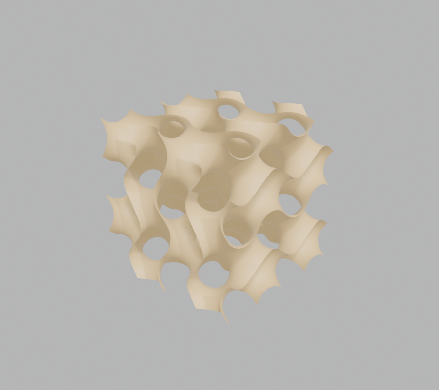
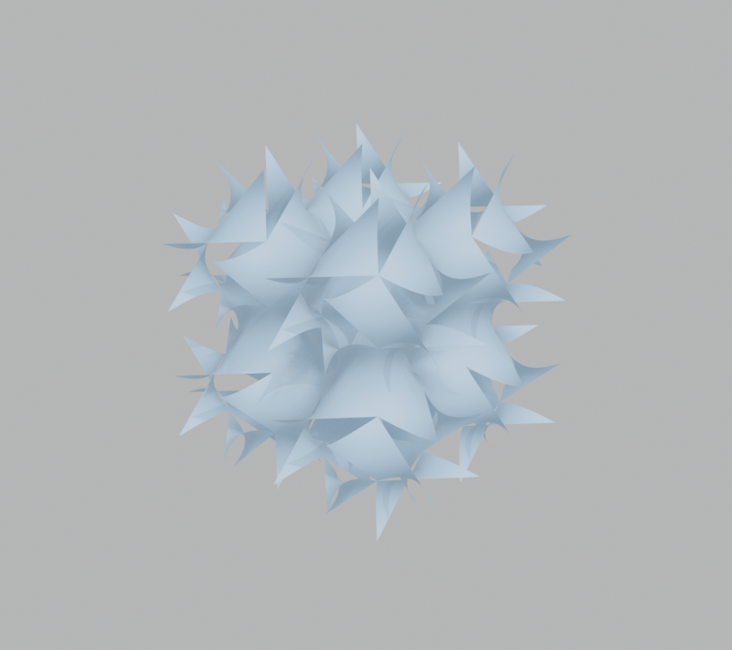
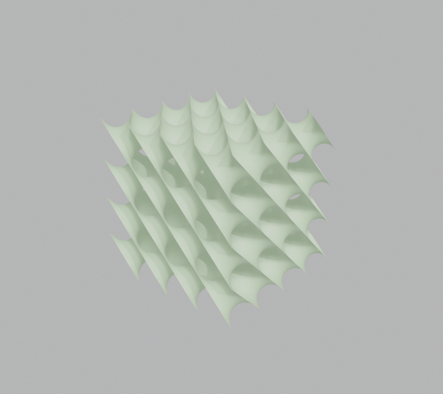
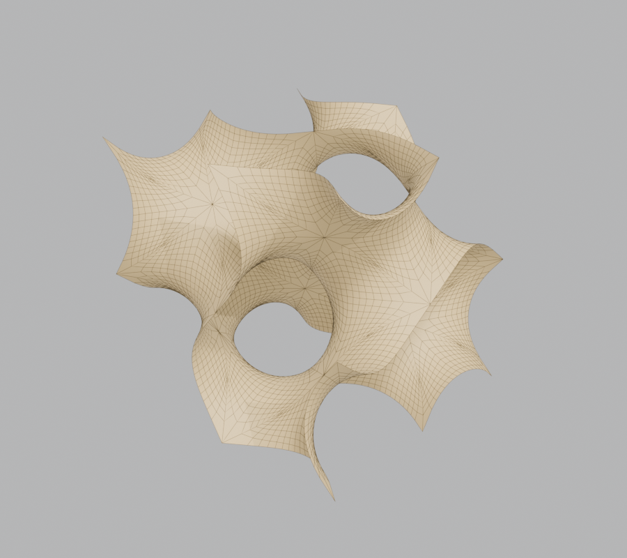
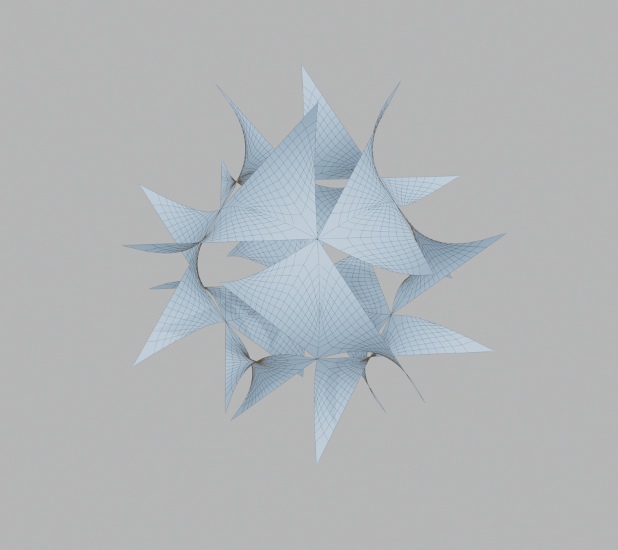
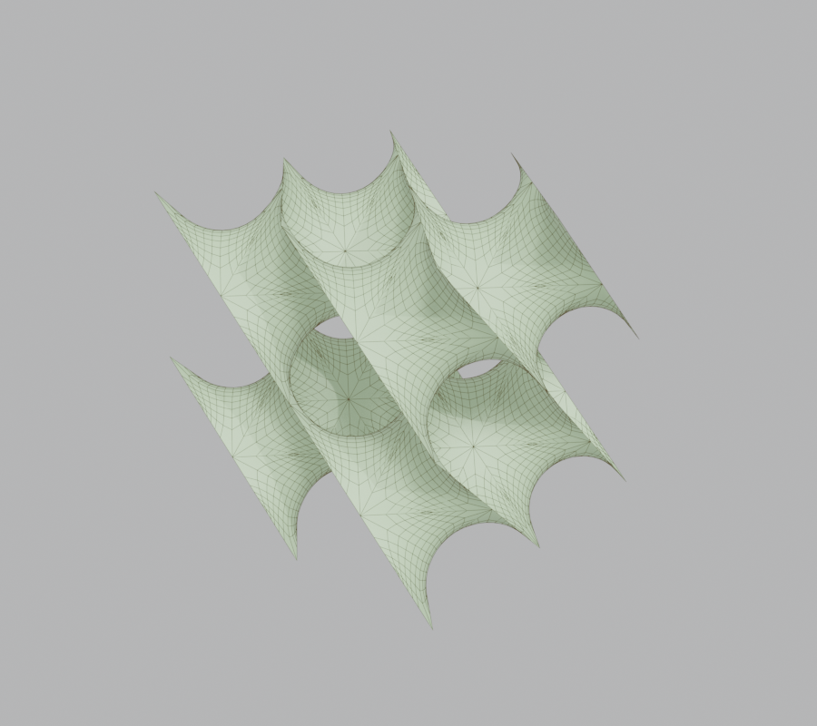

# TPMS Generator

Gyroid, Schwarz P and Schwarz D lattices for Blender 4.2+, generated as
clean all-quad meshes from their exact parametrizations.

Blender 4.2+ 插件，生成 Gyroid、Schwarz P、Schwarz D 三种极小曲面点阵，
输出由精确参数化直接得到的全四边形网格。

| Gyroid (2×2×2) | Schwarz P (2×2×2) | Schwarz D (2×2×2) |
|:---:|:---:|:---:|
|  |  |  |

| Gyroid cell | Schwarz P cell | Schwarz D cell |
|:---:|:---:|:---:|
|  |  |  |

[English](#english) | [中文](#中文)

---

## English

Most tools produce TPMS geometry by extracting an iso-surface from a
voxel grid, which leaves you with a heavy triangle mesh that still needs
cleanup before it is usable. This add-on evaluates the surfaces
analytically, and the difference shows in everything you do afterwards.

**Mesh quality.** Every face is a quad, laid out along the surface's own
parameter lines — the wireframes above are the actual output. The shape
is exact at any density, so there are no voxel steps, no skinny
triangles, and nothing to retopologize; a Subdivision Surface modifier
can be dropped on top directly.

**Low face count, instant generation.** Because coarse meshes are still
faithful, a gyroid cell needs only ~6k quads where an iso-surface mesh
of similar quality takes an order of magnitude more triangles. A cell
builds in milliseconds, so iterating on parameters feels immediate.

**Convenient to tile and edit.** The generator emits a single unit cell
with three Array modifiers already attached. Cell counts along X/Y/Z
stay editable on the modifiers, the tiled cells join without visible
seams, and applying the modifiers merges everything into one watertight
lattice.

### Installation

1. Download this repository (Code → Download ZIP, or `git clone`).
2. In Blender, open Edit → Preferences → Add-ons → ⌄ → *Install from
   Disk* and select the ZIP or folder.
3. Enable **TPMS Generator**.

Blender 4.2+ is required. The add-on is pure Python + numpy (bundled
with Blender) and has no external dependencies.

### Usage

Open the N-panel in the 3D viewport and switch to the **TPMS** tab.
Pick a surface type, set the cell size, the cell counts and the
resolution, then press **Generate TPMS**.

Resolution counts quads per fundamental patch edge; since the shape is
exact at any setting, raising it only smooths silhouettes. Gyroid and
Schwarz D blocks come out box-clean. Schwarz P is the one exception in
appearance: its patches straddle the cell faces, so a finite block has
a ragged skin even though the tiling itself is seamless — trim with a
Boolean when you need a flat-cut P block.

### The mathematics

The surfaces are computed from their Enneper–Weierstrass
parametrizations, following the exact-computation papers of Gandy,
Cvijović, Mackay & Klinowski; the isometries that assemble a unit cell
were derived numerically and verified against the surfaces' space
groups. The full write-up — formulas, derivation and the verification
suite — is in [docs/mathematics.md](docs/mathematics.md).

---

## 中文

多数工具生成 TPMS 的方式是从体素网格里提取等值面，得到的三角网格又重又
乱，用之前还得清理。本插件改为解析求值曲面，这个差别会体现在后续使用的
每个环节。

**网格质量。**所有面都是四边形，沿曲面自身的参数线排布——上面的线框图就
是实际输出。形状在任何密度下都精确，没有体素台阶、没有细长三角形、不需
要重拓扑，直接加一个细分曲面修改器就能用。

**面数少，生成快。**粗网格也同样忠实，所以一个 Gyroid 晶胞只要约 6 千个
四边形，同等质量的等值面网格需要多一个数量级的三角形。单个晶胞毫秒级生
成，调参数几乎是即时反馈。

**平铺和编辑方便。**生成器输出一个晶胞，三个 Array 修改器已经挂好。X/Y/Z
方向的晶胞数量可以在修改器上随时改，平铺的晶胞之间没有可见接缝，应用修
改器后合并成一个水密的整体点阵。

### 安装

1. 下载本仓库（Code → Download ZIP，或 `git clone`）。
2. 在 Blender 中打开 Edit → Preferences → Add-ons → ⌄ → *Install from
   Disk*，选择 ZIP 或文件夹。
3. 启用 **TPMS Generator**。

需要 Blender 4.2+。插件为纯 Python + numpy（Blender 自带），无外部依赖。

### 使用

在 3D 视口打开 N 面板，切换到 **TPMS** 标签页。选择曲面类型，设置晶胞尺
寸、晶胞数量和分辨率，点击 **Generate TPMS**。

分辨率指每个基本片边上的四边形数；形状在任何设置下都精确，提高分辨率只
是让轮廓更平滑。Gyroid 和 Schwarz D 的块体边缘是方正的。Schwarz P 在外
观上是个例外：它的基本片会斜跨晶胞面，有限大小的块体表皮参差（平铺本身
仍然无缝）——需要平切的 P 块体时用 Boolean 修整一下。

### 数学背景

曲面由 Enneper–Weierstrass 参数化计算，依据 Gandy、Cvijović、Mackay 与
Klinowski 的精确计算系列论文；拼装晶胞的等距变换经数值推导得到，并对照
曲面的空间群做了验证。完整的公式、推导过程和验证结果见
[docs/mathematics.md](docs/mathematics.md)。

## License

MIT
